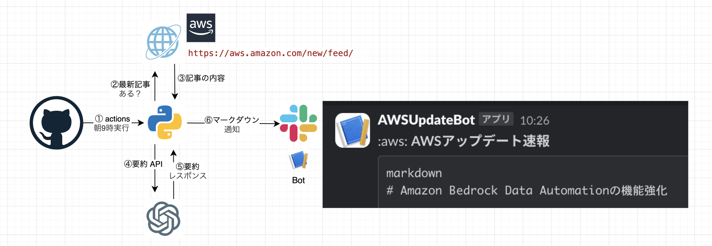

# aws-update-summarize-bot
朝9時にawsの最新情報をキャッチアップ、要約と検証方法をslack通知するbot

# 前提
お金がかかります。
現時点の料金で、約1000円 / 年です。
また、これはGPT4oモデルの料金なので、コストを節約したい場合は以下のことをしてください
- 後述のapiキーの発行で、mini系を選択
- `notify_aws_update.py` の以下部分を変更
```
    response = client.chat.completions.create(
        model="<ここをモデル名にする>",
        messages=[{"role": "user", "content": prompt}]
    )
```


# 構成図


# 構築手順

## slack botのwebhook URLの用意
slackのbotの実態は、slackの機能であるAppです。
そのAppにメッセージを送るために、webhook urlを用意します。

下記を参考に用意してください。
公式：https://api.slack.com/messaging/webhooks
わかりやすさすごめ：https://zenn.dev/hotaka_noda/articles/4a6f0ccee73a18

## webhook urlをGithub　Secretsに用意
Github Actionsで動く、pythonスクリプトから参照するため、Github　Secretsにwebhook urlを作成します。
**※Secretsは以下規則を守り作成してください。**
- Name: `SLACK_WEBHOOK_URL`
- Value: `<上記で発行したURL>`

下記を参考に作成してください。
公式：https://docs.github.com/ja/actions/security-for-github-actions/security-guides/using-secrets-in-github-actions

## Open AI APIkey と クレジットの用意
Pythonスクリプトが要約リクエストをする時に、認証目的のAPIキーを発行します。

以下を参考にご用意ください。
https://unitomarigi.com/openai-get-apikey-set-up-billing/

## APIkey をGithub　Secretsに用意
Github Actionsで動く、pythonスクリプトから参照するため、Github　Secretsにwebhook urlを作成します。
**※Secretsは以下規則を守り作成してください。**
- Name: `OPENAI_API_KEY`
- Value: `<上記で発行したapiキー>`

下記を参考に作成してください。
公式：https://docs.github.com/ja/actions/security-for-github-actions/security-guides/using-secrets-in-github-actions

